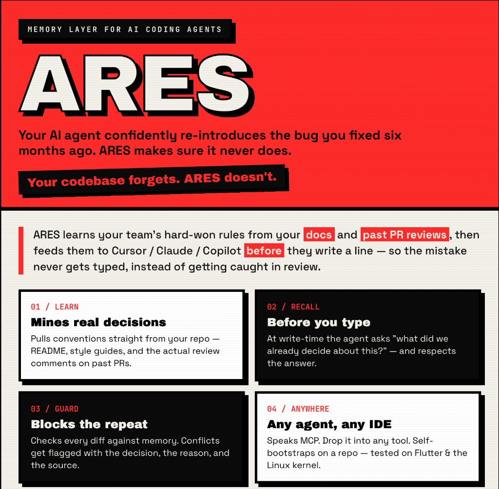

# ARES — Agent Recall & Enforcement Substrate

**The write-time decision-memory substrate for AI coding agents.**
*Your codebase forgets. ARES doesn't.*



ARES is the neutral, write-time decision-memory layer that any coding agent or
reviewer queries — over **MCP** or **REST** — *before* and *during* code
generation. It accumulates a corpus of engineering decisions that compounds
regardless of which IDE, agent, or reviewer a team uses.

The highest-leverage moment in an agent-coded world is **write time**: the
instant Cursor, Claude Code, Copilot, Windsurf, Cline, or Codex is about to
generate code. ARES answers the question worth the most money — *"What has this
team already decided about this?"* — so the mistake never gets typed, instead
of getting scolded in review.

---

## Architecture

```
            ┌──────────────────────── MCP clients (any IDE/agent) ────────────────────────┐
            │  Cursor · Claude Code/Desktop · Copilot · Windsurf · Cline · Codex · CI bots │
            └───────────────┬─────────────────────────────────────────┬───────────────────┘
                            │ stdio (local spawn: `ares-mcp`)          │ Streamable HTTP (remote)
                            ▼                                          ▼
            ┌──────────────────────────────────────────────────────────────────────────────┐
            │  ARES Server (Node + Hono)                                                     │
            │                                                                                │
            │  MCP surface (src/mcp/server.ts)            REST surface (src/http/routes.ts)  │
            │   tool  recall_decisions     ─┐              POST /v1/recall      ─┐           │
            │   tool  check_conflict        │              POST /v1/check        │           │
            │   tool  record_decision       │  share       POST /v1/decisions    │  share    │
            │   tool  list_decisions        ├─ core ──►    GET  /v1/decisions     ├─ core ──► │
            │   tool  get_decision          │              GET  /v1/decisions/:id │           │
            │   tool  supersede_decision   ─┘              POST /v1/.../supersede │           │
            │   resource ares://decisions/{id}             POST /v1/extract       │           │
            │   resource ares://repo/{repo}/decisions      POST /v1/ask           │           │
            │                                              POST /v1/overrides     │           │
            │                                              GET  /v1/health       ─┘           │
            │                                                                                │
            │  Core engine (src/core/*)   Providers (src/providers/*)                        │
            │   memory.ts  recordDecision  embeddings.ts  embed/embedBatch (OpenAI|local)    │
            │   review.ts  checkConflict   llm.ts         generateObject/getModel (OpenAI|…) │
            │   judge.ts   judgeConflict                                                     │
            │   extract.ts extractDecisions                                                  │
            └───────────────────────────────────┬────────────────────────────────────────────┘
                                                 ▼
                          ┌───────────────────────────────────────────────┐
                          │  PostgreSQL 16 + pgvector 0.8                  │
                          │   workspaces · api_keys · decisions(halfvec)  │
                          │   overrides · audit_log                       │
                          │   HNSW(halfvec_cosine_ops) on decisions.embed │
                          └───────────────────────────────────────────────┘
```

**Invariants:** embeddings happen server-side (any client sends raw text/diff,
no SDK); a decision's metadata and vector live in **one** Postgres row; the
server is stateless (scale horizontally); every query is filtered by
`workspace_id` resolved from the API key — no query ever crosses workspaces.

---

## Quickstart (one command)

You need **Docker** and an **OpenAI API key**. Then:

```bash
git clone https://github.com/AbhiRam162105/ares.git
cd ares
./setup.sh
```

`setup.sh` will:
1. ask for your `OPENAI_API_KEY` (and reuse your `gh` token if present, for richer PR-review mining),
2. build & start Postgres (pgvector) + the ARES server on `http://localhost:8787`,
3. create a workspace and print your API key (saved to `.ares-key`),
4. write a ready-to-use Cursor config to `generated/cursor-mcp.json`, and
5. optionally install ARES into Cursor **globally** (MCP server + 3 skills + rule), so every window has it.

Then **reload Cursor**, enable the `ares` server under **Settings → Tools & MCP**, open any repo, and ask:

> "Use the ares-onboard-repo skill to onboard `owner/repo`."

ARES learns the repo's written + unwritten rules (from its docs and PR reviews),
then recalls them before your agent writes code and checks every diff after.

### Connect Cursor manually (if you skipped the auto-install)

Add to `~/.cursor/mcp.json` (global) or a project's `.cursor/mcp.json` — this is
what `setup.sh` generates with your key:

```json
{
  "mcpServers": {
    "ares": {
      "url": "http://localhost:8787/mcp",
      "headers": { "Authorization": "Bearer <YOUR_ARES_KEY>" }
    }
  }
}
```

Then copy the skills/rule: `cp -R cursor/skills/* ~/.cursor/skills/ && cp cursor/rules/ares.mdc ~/.cursor/rules/`.

> Manage the stack: `docker compose logs -f server` · stop `docker compose down` · start `docker compose up -d`.
> Local dev without Docker: run your own Postgres 16 + pgvector, point
> `DATABASE_URL` at it, then `npm run migrate && npm run dev` in `server/`.

### Using it on an existing / "random" repo

ARES only helps once a repo has decisions in your workspace. A fresh repo
starts empty — so bootstrap it from the repo's own written conventions
(README, CONTRIBUTING, `docs/`, ADRs) with the ingest script:

```bash
cd server
# Preview what would be extracted (writes nothing):
npm run ingest -- --github airbnb/javascript --dry-run
# Actually record them under repo_id "airbnb/javascript":
npm run ingest -- --github airbnb/javascript
# Or scan a local clone's markdown docs:
npm run ingest -- --path ../path/to/clone --repo owner/repo
```

It chunks the docs, runs the decision extractor (`/v1/extract`), de-dupes,
and records the high-confidence ones. After that, `recall_decisions` /
`check_conflict` (and the extension) work on that repo. Flags: `--max-chunks`,
`--max-decisions`, `--min-confidence`, `--files a.md,b.md`.

> Tip: pass an `intent` to `check_conflict` (the agent's description of what
> it's doing). Raw code embeds weakly against terse prose rules; the intent
> lifts recall into the range where real conflicts surface.

---

## MCP tools (the primary interface)

Spawn the stdio server (`ares-mcp`) from any MCP-capable IDE/agent, or connect
to the hosted Streamable HTTP endpoint at `POST /mcp`.

| Tool | What it does |
|---|---|
| `recall_decisions` | **The write-time call.** Semantic search over the workspace's active decisions for this repo. Call it BEFORE writing code. |
| `check_conflict` | Given code you just wrote (snippet or diff), return conflicts with the violated decision + reasoning. |
| `record_decision` | Persist a new engineering decision so future code (any agent or human) respects it. |
| `list_decisions` | List decisions, filterable by `repo` and `status`. |
| `get_decision` | Fetch a single decision by id. |
| `supersede_decision` | Mark an old decision `superseded` and link a new one (lifecycle + audit). |

**Resources:** `ares://decisions/{id}` and `ares://repo/{repo}/decisions` let
agents attach the corpus as context.

See `examples/cursor-mcp.json`, `examples/claude-desktop.json`,
`examples/remote-mcp.json`, and `examples/cursor-rule.md`.

---

## REST API (for non-MCP clients: extension, CI, bots)

All routes require `Authorization: Bearer ares_sk_...`.

| Method & path | Body / query | Response |
|---|---|---|
| `POST /v1/recall` | `{ query, repo?, limit? }` | `{ decisions: ScoredDecision[] }` |
| `POST /v1/check` | `CheckInput` (snippet **or** files+hunks) | `{ conflicts: Conflict[] }` |
| `POST /v1/decisions` | `RecordInput` | `Decision` |
| `GET /v1/decisions` | `?repo=&status=` | `{ decisions: Decision[] }` |
| `GET /v1/decisions/:id` | — | `Decision` \| 404 |
| `POST /v1/decisions/:id/supersede` | `RecordInput` | `Decision` |
| `DELETE /v1/decisions/:id` | — | `204` |
| `POST /v1/extract` | `{ text }` | `{ candidates: Candidate[] }` |
| `POST /v1/ask` | `{ question, repo?, history? }` | `{ answer, citations }` (SSE stream) |
| `POST /v1/overrides` | `{ decision_id, location?, type, actor? }` | `{ id }` |
| `GET /v1/health` | — | `{ ok, version, db }` |
| `POST /mcp` | JSON-RPC | MCP Streamable HTTP |

**CI guardrail:** `examples/ci-check.sh` posts a PR diff to `/v1/check` and
fails the build on any conflict with `confidence >= 0.8`. Drop it into any
pipeline with `ARES_API_URL`, `ARES_API_KEY`, and `REPO` set.

---

## Works with any agent / IDE

MCP is the primary interface, so there is **zero ARES-specific code** required
in the agent. Any MCP-capable client can call the tools:

- **Cursor** — `examples/cursor-mcp.json` → `.cursor/mcp.json`
- **Claude Code / Claude Desktop** — `examples/claude-desktop.json` (stdio spawn, proxy mode to hosted ARES)
- **Copilot · Windsurf · Cline · Codex** — same stdio spawn or remote URL transport
- **Clients with URL transports** — `examples/remote-mcp.json` (Streamable HTTP at `/mcp` with a Bearer header)
- **CI bots & non-MCP tools** — the REST API above
- **Chrome extension** — `extension/` is one client among many, repointed at the ARES REST API for review-time visualization

To nudge agents to query memory proactively, ship `examples/cursor-rule.md`
(instructs the agent to call `recall_decisions` before writing code and
`check_conflict` after).

---

## Enterprise & self-hosting

| Concern | ARES answer |
|---|---|
| **Lock-in / pricing** | Storing decisions is **free and unlimited** — the corpus is the customer's asset. Metering is on seats + recall/check volume, never on stored decisions. No row caps anywhere. |
| **Data residency / air-gap** | Fully self-hostable via Docker. Set `EMBED_PROVIDER=local` (fastembed) + `LLM_PROVIDER=ollama` and **zero data leaves your VPC**. No Cloudflare, no mandatory SaaS. |
| **Multi-tenancy** | `workspace_id` on every row; API key → workspace; queries cannot cross tenants. |
| **Governance / audit** | Append-only `audit_log` (record/recall/check/supersede/override/delete); overrides persisted in `overrides`. |
| **Decision lifecycle** | `active → superseded → deprecated` with `supersedes_id` lineage. |
| **Provider risk** | Embeddings + LLM are swappable via env — no single-vendor outage takes the substrate down. |
| **Scale** | Stateless server; HNSW over `halfvec` (50% smaller index); `ef_search` tunable; Postgres scales to millions of decisions per workspace. (Front Postgres with pgbouncer under heavy load.) |

### Air-gapped path

The default schema (`server/migrations/0001_init.sql`) standardizes on **1536**
dims (OpenAI `text-embedding-3-small`). For a fully offline deployment, use the
`halfvec(384)` variant (`server/migrations/0001_init.local.sql`) with
`EMBED_PROVIDER=local` (fastembed `bge-small-en-v1.5`, 384-dim) and
`LLM_PROVIDER=ollama`. Switching providers requires **no code change** — only
env vars.

---

## Project layout

```
ares/
├── docker-compose.yml     # Postgres(pgvector) + server
├── .env.example
├── server/                # Node + Hono + pg; MCP (stdio + Streamable HTTP) + REST
│   ├── Dockerfile
│   ├── migrations/        # 0001_init.sql (1536) + 0001_init.local.sql (384)
│   └── src/               # config, db, core/, providers/, mcp/, http/, scripts/
├── extension/             # MV3 Chrome extension, repointed (one client among many)
└── examples/              # cursor-mcp.json, claude-desktop.json, remote-mcp.json,
                           # ci-check.sh, cursor-rule.md
```

---

## Configuration

All config is environment-driven (`.env`); see `.env.example`. Key knobs:

- `DATABASE_URL` — Postgres 16 + pgvector connection string
- `EMBED_PROVIDER` (`openai` | `local`), `EMBED_MODEL`, `EMBED_DIM`
- `LLM_PROVIDER` (`openai` | `anthropic` | `ollama`), `LLM_MODEL`
- `OPENAI_API_KEY` / `ANTHROPIC_API_KEY`
- `SIMILARITY_THRESHOLD` (default `0.75`), `CONFIDENCE_THRESHOLD` (default `0.6`)
- `ALLOWED_ORIGINS` (CORS)
